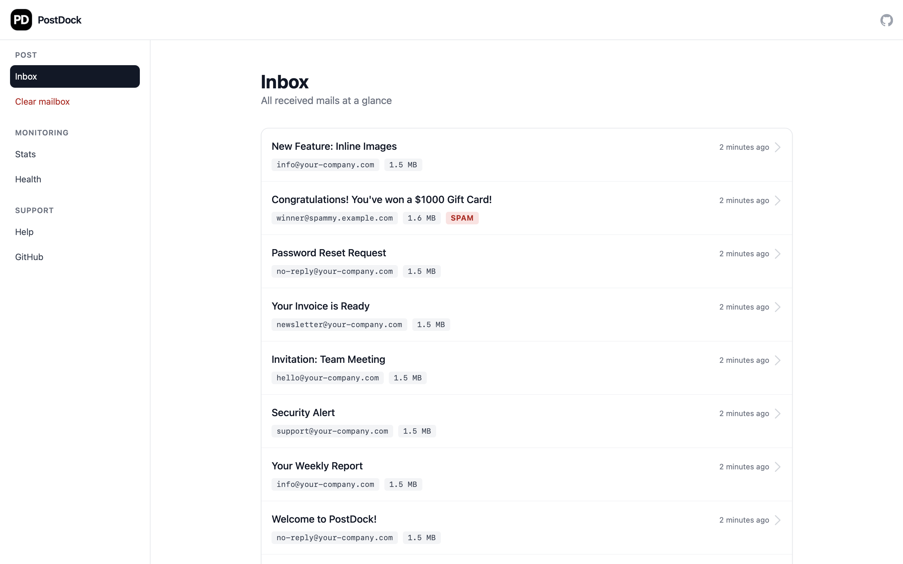

# PostDock <small>Open Source Mailcatcher & Test SMTP Server</small>

[](https://docs.docker.com/compose/)
[](https://fastapi.tiangolo.com/)
[](https://nextjs.org/)
[](https://github.com/ceviixx/postdock/actions/workflows/ci.yml)
[](https://github.com/ceviixx/postdock/releases/latest)

---

**PostDock** is an open-source mailcatcher and **test SMTP server** for developers.
It provides a modern web inbox and REST API to **capture, inspect, debug, and manage emails** in local development, CI/CD pipelines, and QA environments—without ever sending to real mailboxes.
Built with **FastAPI, Next.js, SQLite, and Docker**.

---

## Features

- **Test SMTP Server** - Capture all emails sent to any address/recipient
- **Web Inbox** - Responsive UI to preview HTML, plain text, headers, and raw source
- **Attachments & Images** - Download or view inline images and file attachments
- **Email Debugging Tools** - Inspect headers, spam flags, and delivery metadata
- **Live Updates** - Emails appear instantly via Server-Sent Events (SSE)
- **Inbox Management** - Clear all emails with a single click
- **Stats & Health Dashboard** - View top senders, email counts, and system health
- **REST API for Automation** - Integrate into CI/CD pipelines and QA testing
- **Docker-First** - Run locally or in pipelines with Docker & Docker Compose
- **Client Preview** - Simulate Gmail, Outlook, and Apple Mail rendering (HTML tab)

---

## Quick Start

You need [Docker](https://www.docker.com/) and [Docker Compose](https://docs.docker.com/compose/) installed.

```sh
curl -o docker-compose.yml https://raw.githubusercontent.com/ceviixx/postdock/main/docker-compose.ghcr.yml
# Start frontend + backend + SMTP
docker compose up
```

- Web UI: [http://localhost:3000](http://localhost:3000)
- API docs: [http://localhost:8080/docs](http://localhost:8080/docs)
- SMTP server: `localhost:2525` (no auth required)

---

## Screenshots

### Inbox & Mail details
| Inbox | Mail details |
|---|---|
|  |  |

### Stats & Health
| Stats | Health |
|---|---|
|  |  |

---

## Storage Backends

PostDock supports two storage types:

- **In-Memory** (default): Fast & ephemeral - all emails are lost on restart. Perfect for local dev and CI.
- **SQLite**: Persistent storage in `data/mails.db`. Useful for longer test runs or keeping emails between sessions.

Configure with environment variable in backend:

```sh
STORAGE=memory      # default
STORAGE=sqlite      # persistent storage
```

---

## Usage

- **Send mails** from your app to `localhost:2525`
- **Browse inbox** in the web UI
- **Preview emails** as HTML, plain text, or raw source
- **Download attachments** or inline images
- **Clear inbox** with one click
- **Automate checks** via the REST API

---

## Development

- Frontend: [`/frontend`](./frontend) - Next.js, Tailwind CSS
- Backend: [`/backend`](./backend) - FastAPI, SQLite
